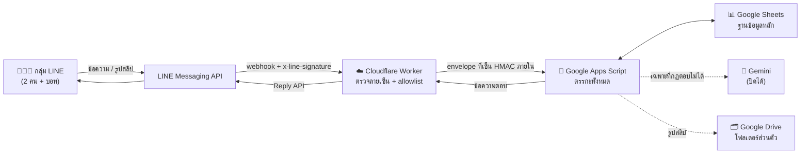

# Household Expense — บัญชีครัวเรือนผ่าน LINE

บอทจดรายจ่ายในกลุ่ม LINE ของครอบครัว พิมพ์ภาษาไทยธรรมดา เช่น `ค่าส้มตำ 200` แล้วระบบจะจัดหมวด บันทึกลง Google Sheets และสรุปยอดให้

> **สถานะ:** โค้ดครบทุก Phase (0–8) และผ่านชุดทดสอบอัตโนมัติ 117 เคสในเครื่องแล้ว
> **ยังไม่ได้ทำ:** ยังไม่ได้สร้างบัญชีจริง ยังไม่ได้ deploy ยังไม่ได้ทดสอบกับ LINE จริง — ขั้นตอนทั้งหมดอยู่ใน [docs/deploy.md](docs/deploy.md)

---

## ระบบทำงานอย่างไร



**ทำไมต้องมี Worker:** LINE เซ็น webhook มาใน HTTP header `x-line-signature` แต่ Apps Script Web App ไม่เปิด header ให้สคริปต์อ่าน จึงต้องตรวจที่ Worker ก่อน และ Apps Script ยังตรวจลายเซ็นภายในซ้ำอีกชั้น เพราะ "URL เป็นความลับ" ไม่นับเป็นการป้องกัน

---

## เริ่มตรงไหน

| ถ้าคุณอยาก... | อ่านไฟล์นี้ |
| --- | --- |
| ติดตั้งระบบครั้งแรก (ทำตามทีละขั้น) | [docs/deploy.md](docs/deploy.md) |
| ใช้งานประจำวัน / สอนภรรยาใช้ | [docs/user-guide.md](docs/user-guide.md) |
| ดูคำสั่งทั้งหมดที่พิมพ์ได้ | [docs/commands.md](docs/commands.md) |
| แก้ปัญหา เปิด/ปิด AI หมุน key ตรวจงานค้าง | [docs/operations.md](docs/operations.md) |
| สำรอง/กู้ข้อมูล | [docs/backup-restore.md](docs/backup-restore.md) |
| ดูค่าตั้งทั้งหมด | [docs/configuration.md](docs/configuration.md) |
| เข้าใจโครงสร้างข้อมูลในชีต | [docs/data-schema.md](docs/data-schema.md) |
| เข้าใจว่า AI ทำอะไรได้/ไม่ได้ | [docs/ai-behavior.md](docs/ai-behavior.md) |
| เปิดใช้อ่านสลิปด้วย OCR | [docs/slip-ocr.md](docs/slip-ocr.md) |
| ดูผลทดสอบและข้อจำกัดที่เหลือ | [docs/uat-results.md](docs/uat-results.md) |

---

## ตัวอย่างการใช้งาน

| พิมพ์ | ระบบทำ |
| --- | --- |
| `ค่าส้มตำ200` | รายจ่าย 200 บาท หมวดอาหาร |
| `กาแฟ 65 ข้าว 80` | 2 รายการ รวม 145 บาท |
| `เมื่อวานเติมน้ำมัน 300` | หมวดเดินทาง วันที่เมื่อวาน (เวลาไทย) |
| `ผ้าอ้อมลูก 499 เมียจ่าย` | หมวดลูก ผู้จ่าย = ภรรยา ผู้บันทึก = คุณ |
| `โอนให้เมีย 3000` | โอนภายใน ไม่นับเป็นรายจ่าย |
| `ซื้อของ 800` | ถามหมวดก่อน ยังไม่นับยอด |
| `ว่าจะซื้อโต๊ะ 5000` | ไม่บันทึก (เป็นแผน ไม่ใช่รายจ่าย) |
| `เดือนนี้ค่าอาหารเท่าไหร่` | อ่านยอดจริงจากชีตมาตอบ |
| ส่งรูปสลิป | อ่านยอด/วันที่ แล้วให้กดยืนยันก่อนบันทึก |

---

## โครงสร้างโปรเจกต์

```
apps-script/     ตรรกะทั้งหมด (Google Apps Script) — 27 ไฟล์ .gs
worker/          Cloudflare Worker (TypeScript) — gateway ตรวจลายเซ็น
docs/            คู่มือทั้งหมด
prompts/         prompt ที่ส่งให้ AI (แก้ได้โดยไม่ต้องแตะโค้ด)
tests/           ชุดทดสอบอัตโนมัติ รันในเครื่องด้วย Node
```

## รันชุดทดสอบ

```bash
npm test
```

ทดสอบครอบคลุมเคส T01–T22 ตามแผน: การคำนวณเงินระดับสตางค์, idempotency, การกู้ batch ที่เขียนค้าง, allowlist, validator ของ AI, งบและการเตือน, การอ่านสลิป และการสำรอง/กู้ข้อมูล — ทั้งหมดรันบน mock ของ Google services ไม่แตะข้อมูลจริง

## หลักการที่ยึดตลอดทั้งระบบ

1. **เงินต้องตรง** — เก็บเป็นจำนวนเต็มหน่วยสตางค์ ไม่ใช้ทศนิยมลอย
2. **ไม่เดาเงิน** — ถ้าจับคู่ยอดกับรายการไม่ชัด ระบบถาม ไม่แบ่งยอดเอง
3. **AI เสนอ โค้ดตัดสิน** — ทุกคำตอบของ AI ผ่าน validator ที่ตรวจว่ายอดมีอยู่ในข้อความจริง หมวดมีอยู่จริง และวันที่ไม่ใช่อนาคต
4. **บอกความจริงเรื่องสถานะ** — ตอบ "บันทึกแล้ว" เฉพาะเมื่อข้อมูลลงชีตครบแล้วเท่านั้น ที่เหลือคือ "รับไว้รอประมวลผล"
5. **ทำซ้ำได้โดยไม่พัง** — ส่งซ้ำ กดปุ่มซ้ำ หรือ retry แล้วยอดไม่บวกเพิ่ม
