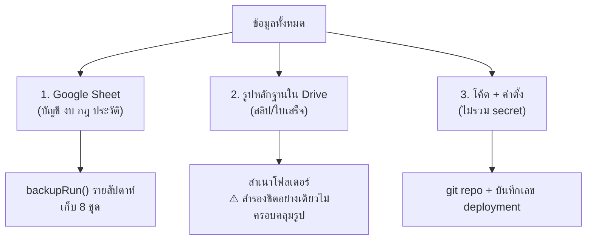
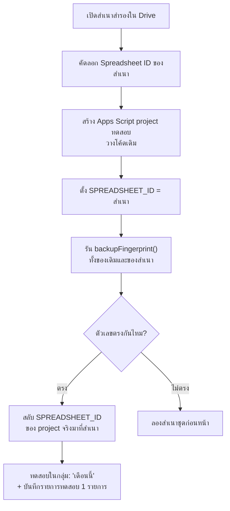

# สำรองและกู้คืนข้อมูล

---

## สิ่งที่ต้องสำรอง 3 อย่าง



---

## 1. สำรอง Google Sheet

**อัตโนมัติ:** ตั้ง `BACKUP_FOLDER_ID` แล้ว `maintenanceRun` (trigger ตี 3) จะสำรองให้ทุกวันอาทิตย์ เก็บ 8 ชุดล่าสุด ชุดเก่ากว่านั้นถูกย้ายลงถังขยะ

**สั่งเอง:** รัน `backupRun()` ใน Apps Script

ไฟล์จะชื่อ `household-expense-backup-2026-09-08-0300`

**ตั้งโฟลเดอร์:**
1. สร้างโฟลเดอร์ใน Google Drive
2. แชร์ให้เฉพาะ 2 คน (อย่าตั้ง "Anyone with the link")
3. คัดลอก ID จาก URL: `https://drive.google.com/drive/folders/`**`1XyZ...`**
4. ใส่เป็น Script Property `BACKUP_FOLDER_ID`

---

## 2. สำรองรูปหลักฐาน

⚠️ **การสำรองชีตไม่ได้สำรองรูป** — ชีตเก็บแค่ `drive_file_id` กับลิงก์

ทำเอง (แนะนำเดือนละครั้ง):
1. เปิดโฟลเดอร์ `ATTACHMENT_FOLDER_ID` ใน Drive
2. คลิกขวา → **Download** (จะได้ zip) เก็บไว้นอกบัญชี Google เช่นฮาร์ดดิสก์ที่บ้าน
3. หรือ: สร้างสำเนาโฟลเดอร์ไว้อีกที่ใน Drive

ถ้ารูปหายแต่ชีตอยู่: รายการบัญชียังถูกต้องครบ แค่ลิงก์หลักฐานเปิดไม่ได้ ยอดเงินไม่กระทบ

---

## 3. สำรองโค้ด

- โค้ดทั้งหมดอยู่ใน git repo นี้แล้ว
- บันทึกไว้ด้วยว่าใช้ Apps Script deployment version ไหน (ดูที่ Manage deployments)
- **ห้าม** เก็บ secret ลงไฟล์ — จดไว้ในโปรแกรมจัดการรหัสผ่านแทน

---

## กู้คืน Sheet



**ขั้นตอนละเอียด:**

1. หาไฟล์สำรองที่ต้องการในโฟลเดอร์ backup
2. **อย่าเพิ่งสลับของจริง** — ทดสอบก่อน:
   - รัน `backupFingerprint()` บนระบบปัจจุบัน คัดลอกผลเก็บไว้
   - เปลี่ยน `SPREADSHEET_ID` ชั่วคราวเป็น ID ของสำเนา
   - รัน `backupFingerprint()` อีกครั้ง
3. เทียบสองผล: จำนวนรายการและยอดสุทธิรายเดือนต้องตรงกัน (บรรทัดละเดือน)
4. ถ้าตรงและตัดสินใจใช้สำเนานั้น: ให้ใช้ `SPREADSHEET_ID` ใหม่นี้ต่อไป
5. ทดสอบในกลุ่ม: พิมพ์ `เดือนนี้` และบันทึกรายการทดสอบ 1 รายการ แล้วยกเลิกทิ้ง

**ผลของ `backupFingerprint()` หน้าตาแบบนี้:**

```
2026-08	rows=42	net=12350.00
2026-09	rows=17	net=4820.50
TOTAL_ROWS	61
ATTACHMENTS	5
```

---

## กู้คืนรูปหลักฐาน

1. อัปโหลดรูปกลับเข้าโฟลเดอร์หลักฐาน
2. ⚠️ Drive จะให้ **file id ใหม่** ลิงก์เดิมในชีตจะเสีย
3. ต้อง remap: แก้คอลัมน์ `drive_file_id` และ `drive_url` ในแท็บ `Attachments` ให้ตรงกับไฟล์ใหม่
   (จับคู่ด้วยชื่อไฟล์ที่มีวันที่และท้าย message id อยู่แล้ว)
4. ยอดเงินและรายการบัญชีไม่กระทบระหว่างนี้

---

## ข้อจำกัดที่ต้องรู้

| สถานการณ์ | สำเนาใน Drive ช่วยได้ไหม |
| --- | --- |
| ลบแถวผิด / แก้ยอดผิด | ✅ ช่วยได้ |
| ไฟล์ชีตถูกลบ | ✅ ช่วยได้ (ถ้าไม่ถูกลบทั้งโฟลเดอร์) |
| สคริปต์เขียนข้อมูลผิดพลาด | ✅ ช่วยได้ |
| **บัญชี Google ถูกระงับ/แฮก** | ❌ **ไม่ช่วย** สำเนาอยู่ในบัญชีเดียวกัน |
| Google หยุดให้บริการ | ❌ ไม่ช่วย |

**ทางแก้:** ดาวน์โหลดชีตเป็น `.xlsx` เก็บนอกบัญชี Google เดือนละครั้ง (File → Download → Microsoft Excel)

---

## ตารางแนะนำ

| ความถี่ | ทำอะไร | ใครทำ |
| --- | --- | --- |
| รายสัปดาห์ | สำเนา Sheet ใน Drive | อัตโนมัติ |
| รายเดือน | ดาวน์โหลด .xlsx + zip รูป เก็บนอกบัญชี Google | ทำเอง |
| ทุก 6 เดือน | ซ้อมกู้คืนจริงกับสำเนาทดสอบ แล้วเทียบ fingerprint | ทำเอง |
| หลังแก้โค้ดใหญ่ | สำรองก่อน deploy | ทำเอง |
