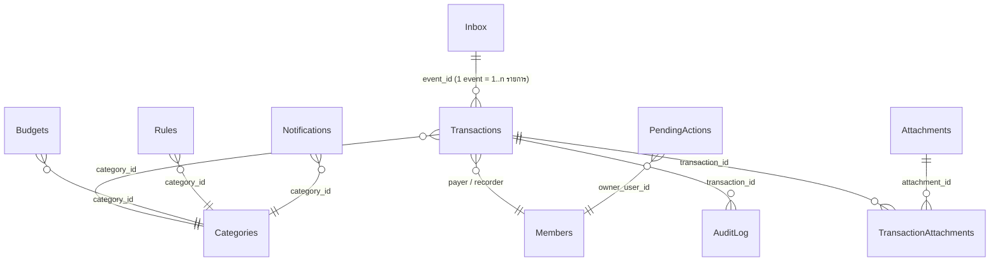
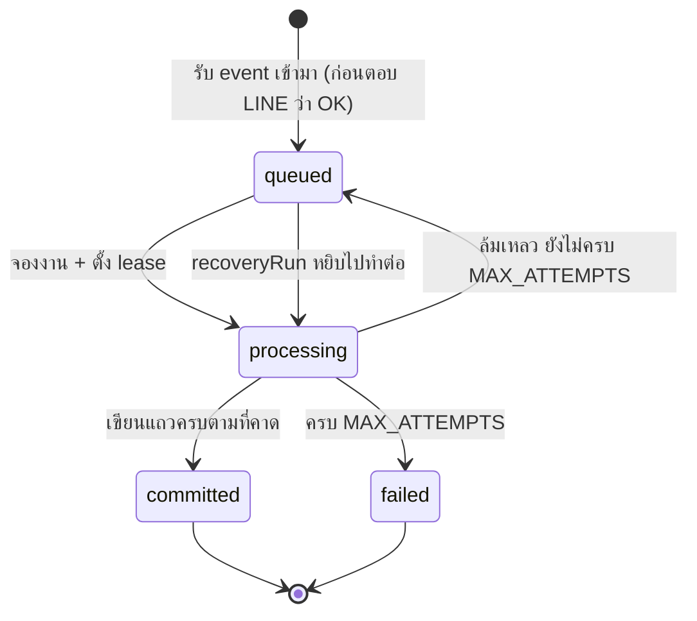

# โครงสร้างข้อมูลใน Google Sheets

Google Sheets เป็นฐานข้อมูลหลัก ไม่มีฐานข้อมูลอื่นเก็บยอดเงินซ้ำ

---

## หลักการเก็บเงิน

- เก็บเป็น **จำนวนเต็มหน่วยสตางค์** เสมอ: 200 บาท = `20000`, 0.30 บาท = `30`
- เก็บเป็น **ค่าบวกเสมอ** ทิศทางอยู่ที่คอลัมน์ `type`
- **รายจ่ายสุทธิ = expense − refund** ไม่รวม `transfer`, ไม่รวม `status=void`, และไม่รวม batch ที่เขียนยังไม่ครบ
- รหัสรายการเป็น ID คงที่ (`T7K2QA`) ไม่ใช่เลขแถว เพราะผู้ใช้ sort ชีตได้
- ข้อความจากผู้ใช้ที่ขึ้นต้นด้วย `=`, `+`, `-`, `@` ถูกเก็บเป็น literal text (นำหน้าด้วย `'`) เพื่อไม่ให้กลายเป็นสูตร

---

## ความสัมพันธ์ของตาราง

---

## Transactions — บัญชีจริง

| คอลัมน์ | ตัวอย่าง | หมายเหตุ |
| --- | --- | --- |
| `transaction_id` | `T7K2QA` | รหัสถาวร |
| `event_id` | `WE01H...` | มาจาก webhook event ของ LINE |
| `item_index` | `0` | ลำดับในข้อความเดียวกัน |
| `batch_id` | `BL9X2A` | กลุ่มการเขียนครั้งเดียวกัน |
| `occurred_date` | `2026-09-08` | วันที่จ่าย (เวลาไทย) |
| `created_at` | ISO 8601 | เวลาที่บันทึก |
| `type` | `expense` \| `refund` \| `transfer` | |
| `description` | `ค่าส้มตำ` | ข้อความที่ตัดมาแล้ว |
| `amount_satang` | `20000` | จำนวนเต็ม บวกเสมอ |
| `category_id` | `food` | ว่างได้เฉพาะ `transfer` |
| `payer_member_id` | `wife` | คนจ่ายจริง |
| `recorder_member_id` | `yut` | คนพิมพ์ |
| `status` | `active` \| `void` | ยกเลิกแบบ soft delete |
| `revision` | `1` | กันการแก้ทับกัน |
| `related_transaction_id` | `T3M8QP` | ใช้กับเงินคืนที่อ้างรายการเดิม |
| `original_text` | `ค่าส้มตำ200` | ข้อความดิบที่ผู้ใช้พิมพ์ |
| `updated_at` | ISO 8601 | |

**Unique key เชิงตรรกะ:** `event_id + item_index` — ส่งซ้ำกี่ครั้งก็ได้แถวเดียว

---

## ตารางอ้างอิง

**Categories** — `category_id, name, active, sort_order`
8 หมวดเริ่มต้น: อาหาร, ของใช้และตกแต่งบ้าน, ลูก, เดินทาง, บิลประจำ, สุขภาพ, ส่วนตัว, อื่น ๆ

**Members** — `member_id, line_user_id, display_name, aliases, active`
`aliases` คั่นด้วยจุลภาค เช่น `เมีย,ภรรยา,แฟน` ใช้เข้าใจว่า "เมียจ่าย" หมายถึงใคร

**Rules** — `rule_id, pattern, match_type, category_id, priority, active, created_by, updated_at`

ลำดับความสำคัญ (ตัวเลขมากชนะ):

| priority | ตัวอย่าง | เหตุผล |
| --- | --- | --- |
| 100–110 | `เติมน้ำมัน`, `ส้มตำ`, `กิน`, `ข้าว` | คำที่บอก**ว่าซื้ออะไร** |
| **95** | กฎที่ผู้ใช้สอนเอง | อยู่เหนือชื่อร้าน แต่ไม่ทับความหมายรายการ |
| 80–90 | `น้ำ`, `ชา`, `ตลาด` | คำกว้าง |
| 40–55 | `อีเกีย`, `โลตัส`, `บ้าน` | ชื่อร้าน/สถานที่ |

เสมอกัน → **pattern ที่ยาวกว่า** (เจาะจงกว่า) ชนะ
ผลลัพธ์: `กินข้าวที่อีเกีย` → อาหาร, `ซื้อของในอีเกีย` → ของใช้และตกแต่งบ้าน

**Budgets** — `month, category_id, limit_satang, warning_percent, updated_by, updated_at`
ไม่มีแถว = "ยังไม่ตั้งงบ" ระบบไม่สร้างงบเอง

---

## ตารางระบบ

**Inbox** — journal ของทุก webhook event

คอลัมน์: `event_id, status, expected_item_count, lease_until, attempts, received_at, completed_at, last_error_code, payload_json, result_json`

- `expected_item_count` ทำให้กู้ batch ที่เขียนค้างได้ โดยเติมเฉพาะแถวที่ขาด
- รายงานนับเฉพาะ event ที่ `committed` — batch ที่เขียนไม่ครบจึงไม่โผล่ในยอด
- `result_json` เก็บข้อความตอบไว้ ถ้า LINE ส่งซ้ำจะได้ตอบเดิม ไม่ทำงานซ้ำ

**PendingActions** — คำถามที่รอคำตอบ
`action_id, event_id, owner_user_id, group_id, action_type, payload_json, expected_revision, expires_at, status, created_at, resolved_at`

ผูกกับ **คนกด + กลุ่ม + รายการ + revision** และหมดอายุได้ → กดซ้ำหรือคนอื่นกดแทนไม่ได้ผล

**AuditLog** — ประวัติการเปลี่ยนแปลงทุกครั้ง (create / edit / void / budget_set / rule_learn / attach_evidence)
`audit_id, action_id, transaction_id, actor_id, action, before_json, after_json, created_at` — **ไม่มีนโยบายลบ**

**Notifications** — กันเตือนซ้ำ key = `เดือน|หมวด|threshold`

**Usage** — `date, provider, model, request_count, input_tokens, output_tokens, estimated_cost_usd`
provider: `gemini` (ข้อความ), `gemini-ocr` (รูป), `line`/`push` (นับโควตา Push)

**Onboarding** — รหัสลงทะเบียนใช้ครั้งเดียว `code, member_id, expires_at, used_by, used_at, status`

**Attachments** — `attachment_id, line_message_id, event_id, uploader_member_id, drive_file_id, drive_url, mime_type, content_hash, document_type, ocr_status, extracted_json, created_at, expires_at`

**TransactionAttachments** — `transaction_id, attachment_id, linked_by, linked_at`
ตารางเชื่อมแบบ many-to-many: ใบเสร็จ 1 ใบแยกเป็นหลายรายการได้ และ 1 รายการแนบหลายรูปได้ โดย**ไม่คัดลอกยอดเงิน**

**Dashboard** — ผลสรุปที่คำนวณโดย `ReportService` เดียวกับที่ LINE ใช้ตอบ ตัวเลขจึงตรงกันเสมอ

---

## การแก้ชีตด้วยมือ

แท็บระบบถูกตั้ง protection แบบ *warning only* — แก้ได้แต่จะมีคำเตือนขึ้น

ถ้าจำเป็นต้องแก้เอง:
1. แก้เฉพาะแท็บ `Transactions`, `Categories`, `Rules`, `Budgets`, `Members`
2. **ห้ามแก้** `transaction_id`, `event_id`, `item_index`, `revision`
3. หลังแก้ ให้รัน `recoveryAudit()` เพื่อตรวจความสอดคล้อง

⚠️ การแก้ด้วยมือไม่ผ่าน ScriptLock และไม่ถูกบันทึกใน AuditLog — ถ้าแก้พร้อมกับที่บอทกำลังเขียนอยู่ ข้อมูลอาจชนกันได้ ทางที่ปลอดภัยคือแก้ผ่านบอท
