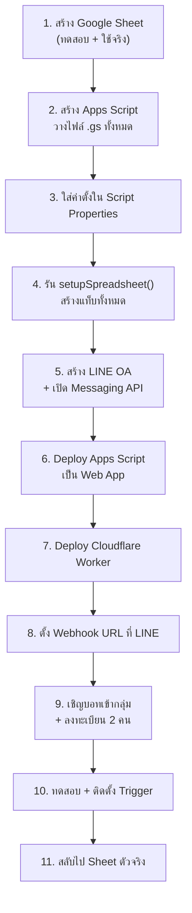
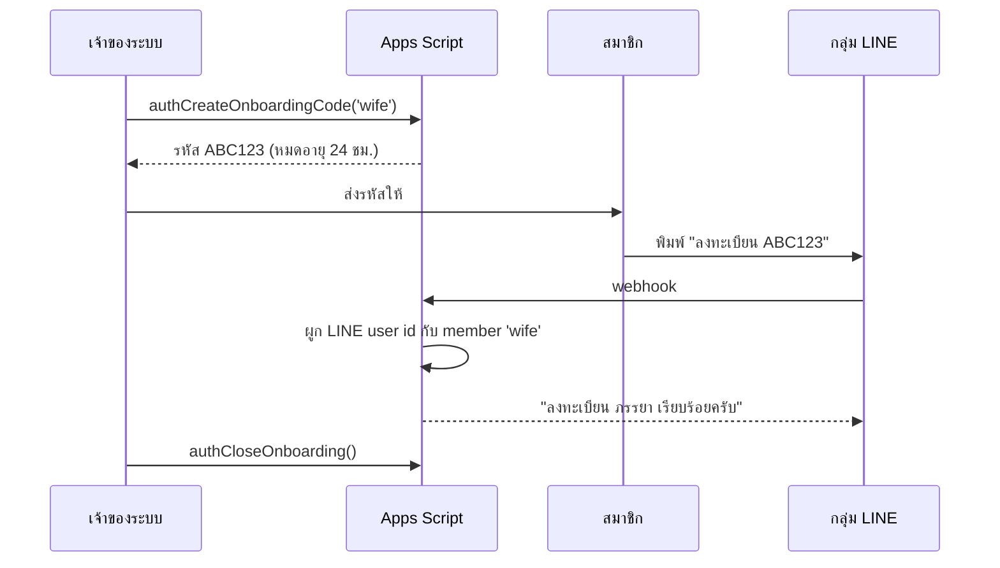
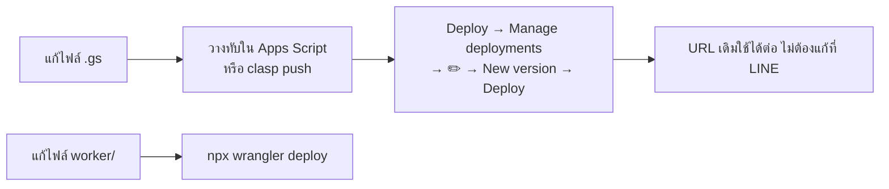

# คู่มือติดตั้ง (Deploy) — ทำตามทีละขั้น

เอกสารนี้เขียนให้ทำตามได้โดยไม่ต้องรู้เบื้องหลัง ใช้เวลาประมาณ 60–90 นาที ทำครั้งเดียว

> ⚠️ **ยังไม่มีการสร้างบัญชีหรือ deploy ใด ๆ ไว้ให้** ทุกขั้นในเอกสารนี้คุณต้องทำเอง

---

## ภาพรวมขั้นตอน



---

## สิ่งที่ต้องเตรียม

- บัญชี Google ส่วนตัว (แนะนำบัญชีส่วนตัว ไม่ใช่บัญชีบริษัท เพราะเป็นข้อมูลครอบครัว)
- บัญชี LINE ที่จะสร้าง Official Account (ฟรี)
- บัญชี Cloudflare (ฟรี)
- Node.js บนเครื่อง (สำหรับ deploy Worker) — ตรวจด้วย `node -v`

---

## ขั้นที่ 1 — สร้าง Google Sheets 2 ไฟล์

1. เปิด https://sheets.google.com สร้างไฟล์ใหม่ ตั้งชื่อ `Household Expense (TEST)`
2. สร้างอีกไฟล์ ตั้งชื่อ `Household Expense (PROD)`
3. คัดลอก **Spreadsheet ID** ของทั้งสองไฟล์เก็บไว้ — คือส่วนกลาง URL

   `https://docs.google.com/spreadsheets/d/`**`1AbC...xyz`**`/edit`

4. ที่ไฟล์ TEST: เมนู `File → Settings` ตั้ง **Time zone = (GMT+07:00) Bangkok** แล้ว Save

> ทำงานกับไฟล์ TEST ก่อนตลอด ค่อยสลับไป PROD ตอนขั้นที่ 11

---

## ขั้นที่ 2 — สร้างโปรเจกต์ Apps Script และวางโค้ด

1. เปิด https://script.google.com → **New project** → ตั้งชื่อ `Household Expense Backend`
2. คลิกไอคอนเฟือง ⚙️ (Project Settings) → ติ๊ก **"Show appsscript.json manifest file in editor"**
3. กลับไปแท็บ Editor แล้ว **วางไฟล์จากโฟลเดอร์ `apps-script/` ทีละไฟล์**
   - ลบไฟล์ `Code.gs` ที่มีมาให้ทิ้ง
   - กด `+` → Script → ตั้งชื่อให้ตรงกับชื่อไฟล์ (ไม่ต้องใส่ `.gs`) แล้ว copy-paste เนื้อไฟล์
   - เปิด `appsscript.json` แล้ววางทับด้วยเนื้อของ `apps-script/appsscript.json`

   ไฟล์ที่ต้องมีครบ (27 ไฟล์):

   ```
   Config  Money  Time  Ids  SheetRepository  Setup  EventService  AuditService
   Members  TransactionService  CategoryRules  ExpenseParser  PendingActionService
   MessageTemplates  ReportService  BudgetService  NotificationService  LineService
   Auth  Webhook  Recovery  IntentRouter  AiService  AiSchema  AiBudgetService
   RuleLearningService  Dashboard  Scheduler  Backup  Maintenance
   AttachmentService  OcrService  OcrSchema  SlipParser  DuplicateDetection
   ```

> **ทางลัดสำหรับคนใช้ command line:** ติดตั้ง `npm i -g @google/clasp` → `clasp login` → คัดลอก `.clasp.json.example` เป็น `.clasp.json` ใส่ `scriptId` แล้ว `clasp push` จะอัปโหลดทั้งโฟลเดอร์ให้อัตโนมัติ

---

## ขั้นที่ 3 — ใส่ค่าตั้ง (Script Properties)

ใน Apps Script: ⚙️ **Project Settings → Script properties → Add script property**

ใส่ 2 ตัวนี้ก่อน (ที่เหลือใส่ทีหลังเมื่อได้ค่ามา):

| Property | ค่า |
| --- | --- |
| `SPREADSHEET_ID` | ID ของไฟล์ TEST จากขั้นที่ 1 |
| `INTERNAL_SIGNING_SECRET` | สุ่มขึ้นมาเอง อย่างน้อย 32 ตัวอักษร |

วิธีสุ่ม secret (รันในเครื่อง):

```bash
node -e "console.log(require('crypto').randomBytes(32).toString('hex'))"
```

> 🔒 **ห้าม** ใส่ค่าเหล่านี้ลงในไฟล์โค้ดหรือช่องในชีตเด็ดขาด — Script Properties เท่านั้น

---

## ขั้นที่ 4 — สร้างแท็บในชีต

1. ใน Apps Script เลือกฟังก์ชัน `setupSpreadsheet` จาก dropdown ด้านบน → กด **Run**
2. ครั้งแรกจะขออนุญาต → **Review permissions → เลือกบัญชี → Advanced → Go to ... (unsafe) → Allow**
   (ที่ขึ้นว่า unsafe เพราะเป็นสคริปต์ของเราเองที่ยังไม่ได้ verify กับ Google ไม่ใช่ความผิดปกติ)
3. กลับไปดูใน Sheet จะมีแท็บครบ: Transactions, Categories, Rules, Members, Budgets, Inbox, PendingActions, AuditLog, Notifications, Usage, Onboarding, Attachments, TransactionAttachments, Dashboard

รันซ้ำกี่ครั้งก็ได้ ข้อมูลเดิมไม่หาย

---

## ขั้นที่ 5 — สร้าง LINE Official Account

1. เปิด https://developers.line.biz/console/ → login ด้วย LINE
2. **Create a new provider** → ตั้งชื่อ เช่น `Family`
3. ในโปรไวเดอร์นั้น → **Create a Messaging API channel** → กรอกชื่อบอท เช่น `บัญชีบ้านเรา`
4. ไปแท็บ **Messaging API**:
   - **Channel access token (long-lived)** → กด Issue → คัดลอกเก็บไว้
   - **Allow bot to join group chats** → เปิด (ที่ LINE Official Account Manager → Settings → Response settings)
   - **Auto-reply messages / Greeting messages** → **ปิด** (ไม่งั้นจะตอบซ้ำกับบอทเรา)
5. ไปแท็บ **Basic settings** → คัดลอก **Channel secret**

เพิ่มลง Script Properties:

| Property | ค่า |
| --- | --- |
| `LINE_CHANNEL_SECRET` | จาก Basic settings |
| `LINE_CHANNEL_ACCESS_TOKEN` | จาก Messaging API |

---

## ขั้นที่ 6 — Deploy Apps Script เป็น Web App

1. ปุ่ม **Deploy → New deployment**
2. เลือกชนิด (ไอคอนเฟือง) → **Web app**
3. ตั้งค่า:
   - Description: `v1`
   - Execute as: **Me (บัญชีคุณ)**
   - Who has access: **Anyone** ← จำเป็น เพราะ Cloudflare Worker ต้องเรียกได้โดยไม่ต้อง login
4. **Deploy** → คัดลอก **Web app URL** (ลงท้ายด้วย `/exec`)

> ปลอดภัยไหมที่ตั้ง Anyone? — ปลอดภัย เพราะทุก request ต้องมีลายเซ็น HMAC ที่ถูกต้องจาก `INTERNAL_SIGNING_SECRET` ถ้าไม่มีจะถูกปฏิเสธทันทีและไม่เกิดรายการใด ๆ (มีเทสครอบคลุมข้อนี้)

---

## ขั้นที่ 7 — Deploy Cloudflare Worker

```bash
cd worker
npm install
npx wrangler login
```

แก้ไฟล์ `worker/wrangler.toml` ใส่ค่า:

```toml
[vars]
APPS_SCRIPT_URL = "<Web app URL จากขั้นที่ 6>"
ALLOWED_GROUP_ID = "ใส่ทีหลังในขั้นที่ 9"
BACKEND_TIMEOUT_MS = "25000"
```

ใส่ secret (คำสั่งจะถามค่าให้พิมพ์ ไม่บันทึกลงไฟล์):

```bash
npx wrangler secret put LINE_CHANNEL_SECRET
npx wrangler secret put LINE_CHANNEL_ACCESS_TOKEN
npx wrangler secret put INTERNAL_SIGNING_SECRET
```

> `INTERNAL_SIGNING_SECRET` ต้องเป็นค่า **เดียวกัน** กับที่ใส่ใน Apps Script

Deploy:

```bash
npx wrangler deploy
```

จะได้ URL แบบ `https://household-expense-gateway.<ชื่อคุณ>.workers.dev` — คัดลอกไว้

ทดสอบว่ายังมีชีวิต:

```bash
curl https://household-expense-gateway.<ชื่อคุณ>.workers.dev/health
```

---

## ขั้นที่ 8 — ตั้ง Webhook ที่ LINE

1. กลับไป LINE Developers Console → แท็บ **Messaging API**
2. **Webhook URL** = URL ของ Worker จากขั้นที่ 7
3. เปิด **Use webhook**
4. กด **Verify** → ต้องขึ้น **Success**

   ถ้าไม่ success: ดู [แก้ปัญหา](#แก้ปัญหาที่พบบ่อย) ด้านล่าง

---

## ขั้นที่ 9 — เชิญบอทเข้ากลุ่มและลงทะเบียน 2 คน

1. สร้างกลุ่ม LINE ใหม่ที่มีคุณ + ภรรยา
2. เชิญบอท (ค้นหา LINE ID ของ OA ได้จาก LINE Official Account Manager)
3. **หา Group ID:** ส่งข้อความอะไรก็ได้ในกลุ่ม แล้วดูใน Apps Script → **Executions** → เปิด log ล่าสุด
   จะเห็นบรรทัด `envelope rejected` หรือ error พร้อม groupId — หรือดูง่ายกว่านั้น:
   เปิดแท็บ `Inbox` ในชีต จะมีแถวใหม่ ในคอลัมน์ `payload_json` มี `"groupId":"Cxxxxx..."`
4. เอา Group ID ไปใส่ทั้ง 2 ที่:
   - Script Properties: `ALLOWED_GROUP_ID`
   - `worker/wrangler.toml` → `ALLOWED_GROUP_ID` แล้ว `npx wrangler deploy` อีกครั้ง

5. **ลงทะเบียนสมาชิก** — ใน Apps Script เปิด console แล้วรันทีละคำสั่ง:

   สร้างสมาชิกก่อน (แก้ชื่อเล่นตามจริง):
   ```javascript
   function setupMembersOnce() {
     setupAddMember('yut', '', 'ยุทธ', 'ยุทธ,ผม,สามี,พี่');
     setupAddMember('wife', '', 'ภรรยา', 'เมีย,ภรรยา,แฟน');
   }
   ```
   วางฟังก์ชันนี้ในไฟล์ใหม่ชื่อ `Local.gs` แล้ว Run

   เปิด onboarding ชั่วคราว: Script Properties → `ONBOARDING_ENABLED` = `true`

   สร้างรหัสให้แต่ละคน — รัน `authCreateOnboardingCode` (แก้พารามิเตอร์ใน Local.gs):
   ```javascript
   function makeCodes() {
     Logger.log(authCreateOnboardingCode('yut', 24));
     Logger.log(authCreateOnboardingCode('wife', 24));
   }
   ```
   ดูรหัส 6 ตัวใน **Execution log**

6. แต่ละคนพิมพ์ในกลุ่ม: `ลงทะเบียน XXXXXX` (รหัสของตัวเอง)
7. เสร็จแล้ว **ปิด onboarding**: รัน `authCloseOnboarding()` หรือตั้ง `ONBOARDING_ENABLED` = `false`



---

## ขั้นที่ 10 — ทดสอบและติดตั้ง Trigger

ทดสอบในกลุ่ม:

| พิมพ์ | ควรได้ |
| --- | --- |
| `ช่วยเหลือ` | เมนูวิธีใช้ |
| `ค่าส้มตำ 200` | ✅ บันทึกแล้ว พร้อมรหัส T..... |
| `เดือนนี้` | สรุปยอด 200 บาท |
| `ยกเลิก T.....` | ถามยืนยัน → กดยืนยัน → ยอดกลับเป็น 0 |
| `สถานะ` | สรุปสถานะระบบ |

ติดตั้ง trigger อัตโนมัติ — รัน `schedulerInstall()` ครั้งเดียว จะได้:
- `recoveryRun` ทุก 10 นาที (เก็บงานค้าง)
- `maintenanceRun` ทุกวันตี 3 (ล้างของหมดอายุ + สำรองวันอาทิตย์)
- `dashboardRefreshTrigger` ทุก 6 ชั่วโมง

> เวลาของ trigger ใน Apps Script คลาดเคลื่อนได้เป็นสิบนาที ระบบจึงเขียนว่า "ช่วงประมาณ" ไม่รับประกันตรงนาที

---

## ขั้นที่ 11 — สลับไปใช้ Sheet ตัวจริง

1. เปลี่ยน Script Properties → `SPREADSHEET_ID` = ID ของไฟล์ **PROD**
2. รัน `setupSpreadsheet()` อีกครั้ง (สร้างแท็บในไฟล์ PROD)
3. รัน `setupMembersOnce()` อีกครั้ง แล้วลงทะเบียนใหม่ตามขั้นที่ 9 ข้อ 5–7
   (หรือคัดลอกแถวในแท็บ `Members` จากไฟล์ TEST มาวางตรง ๆ ก็ได้)
4. ตั้งค่าโฟลเดอร์สำรอง: สร้างโฟลเดอร์ใน Drive → คัดลอก ID จาก URL → ใส่เป็น `BACKUP_FOLDER_ID`
5. เริ่มใช้จริง

---

## ของเสริม (เปิดทีหลังก็ได้)

### เปิด AI (Phase 4)

1. สร้าง API key ที่ https://aistudio.google.com/apikey
2. Script Properties: `GEMINI_API_KEY` = key, `AI_ENABLED` = `true`
3. ตั้งเพดานงบ: `AI_MONTHLY_BUDGET_USD` (ค่าเริ่มต้น 1.00 USD/เดือน)

รายละเอียด: [ai-behavior.md](ai-behavior.md)

### เปิดอ่านสลิป (Phase 8)

1. สร้างโฟลเดอร์ Drive ชื่อ `Household Expense Evidence` → แชร์ให้เฉพาะ 2 คน → คัดลอก ID
2. Script Properties: `ATTACHMENT_FOLDER_ID` = ID, `OCR_ENABLED` = `true`

รายละเอียด: [slip-ocr.md](slip-ocr.md)

### เปิดสรุปอัตโนมัติ (Push)

`PUSH_ENABLED` = `true`, `DAILY_SUMMARY_ENABLED` = `true` แล้วรัน `schedulerInstall()` ใหม่

> LINE แพ็กเกจฟรีในไทยส่ง Push ได้ ~300 ข้อความ/เดือน นับตามจำนวนผู้รับ (กลุ่ม 2 คน = 2 ข้อความต่อการส่ง 1 ครั้ง) ส่วนการตอบกลับ (Reply) ไม่นับโควตา ระบบกันโควตาส่วนหนึ่งไว้แจ้งงานค้างเสมอ

---

## แก้ปัญหาที่พบบ่อย

| อาการ | สาเหตุที่เป็นไปได้ | วิธีแก้ |
| --- | --- | --- |
| LINE Verify ไม่ผ่าน | Worker ยังไม่ deploy / URL ผิด | `curl <worker>/health` ต้องได้ `{"ok":true}` |
| Verify ผ่านแต่บอทเงียบ | `ALLOWED_GROUP_ID` ผิด หรือยังไม่ลงทะเบียนสมาชิก | ดู `Inbox` ในชีตว่ามีแถวเข้ามาไหม, ตรวจ groupId ให้ตรงทั้ง Worker และ Script Properties |
| ตอบว่า "ระบบมีปัญหาชั่วคราว" | ดู error code ในข้อความ | เปิด Apps Script → Executions ดู log ล่าสุด |
| ตอบช้าแล้วบอกว่า "รับไว้รอประมวลผล" | ชีตใหญ่/Apps Script ช้า | ปกติ — `recoveryRun` จะทำต่อให้ พิมพ์ `สถานะ` เพื่อตรวจ |
| `CONFIG_MISSING:xxx` | ยังไม่ได้ใส่ Script Property ตัวนั้น | ใส่ให้ครบตาม [configuration.md](configuration.md) |
| Worker log ขึ้น `BACKEND_HTTP_401/403` | Web App deploy เป็น "Only myself" | Deploy ใหม่โดยตั้ง Who has access = Anyone |
| ยอดในชีตไม่ตรงกับที่บอทตอบ | มีคนแก้ชีตด้วยมือ | รัน `recoveryAudit()` ดูรายการที่ไม่สอดคล้อง |

ตรวจสุขภาพระบบทั้งหมดในคำสั่งเดียว: รัน `maintenanceStatusReport()` ใน Apps Script (ไม่แสดง secret ใด ๆ)

---

## เมื่อแก้โค้ดแล้วต้องทำอะไร



⚠️ ถ้ากด **New deployment** แทน **New version** จะได้ URL ใหม่ ต้องไปแก้ `APPS_SCRIPT_URL` ใน wrangler.toml ด้วย
