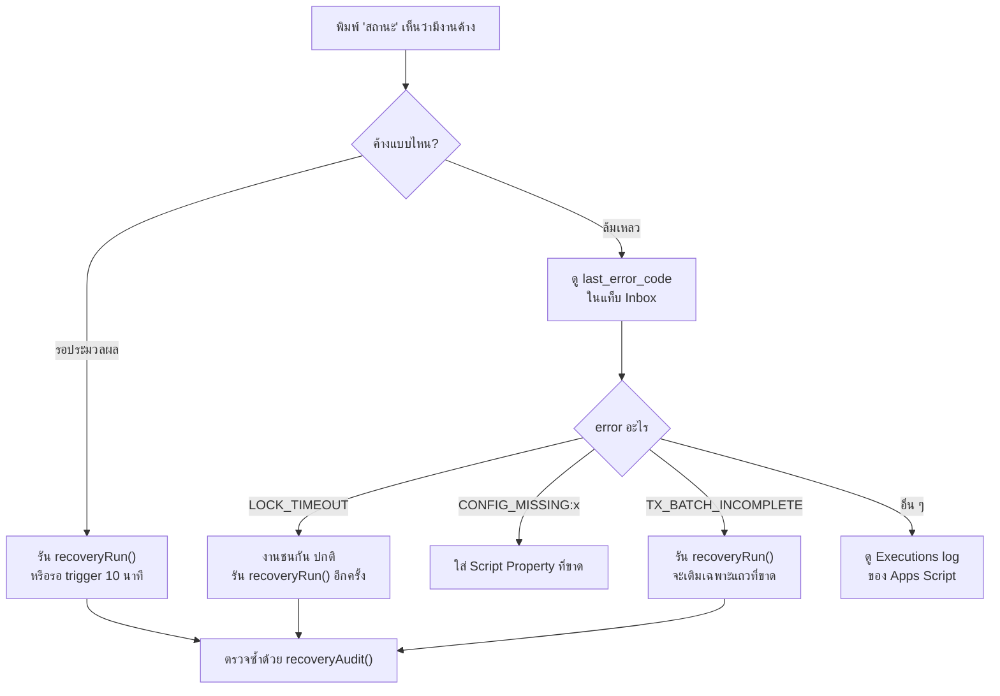
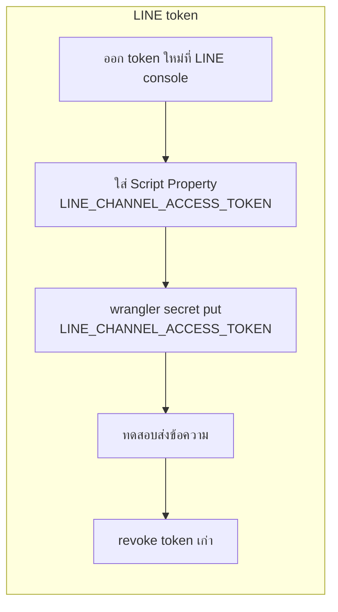

# คู่มือดูแลระบบ (Operations)

สำหรับเจ้าของระบบ เมื่อมีอะไรผิดปกติหรือต้องเปลี่ยนค่า

---

## เช็คสุขภาพระบบ

**จากในกลุ่ม LINE:** พิมพ์ `สถานะ`

**แบบละเอียด:** Apps Script → เลือก `maintenanceStatusReport` → Run → ดู Execution log

รายงานจะบอก: config ครบไหม, งานค้าง/ล้มเหลวกี่งาน, คำถามที่รอคำตอบ, งบ AI ที่ใช้ไป, โควตา Push, และรายการข้อมูลที่ไม่สอดคล้อง — **ไม่แสดง secret ใด ๆ**

---

## เมื่อมีงานค้างหรือล้มเหลว

**สำคัญ:** งานที่ล้มเหลวไม่เคยทำให้ยอดผิด เพราะระบบจะบันทึกก็ต่อเมื่อเขียนแถวครบตามที่คาดเท่านั้น — batch ที่เขียนไม่ครบจะไม่ถูกนับในรายงานจนกว่าจะซ่อมเสร็จ

---

## เปิด/ปิดฟีเจอร์

รันฟังก์ชันใน Apps Script (มีผลทันที ไม่ต้อง deploy ใหม่):

| ต้องการ | รัน |
| --- | --- |
| ปิด AI (เช่น ค่าใช้จ่ายพุ่ง) | `maintenanceDisableAi()` |
| เปิด AI | `maintenanceEnableAi()` |
| ปิดการแจ้งเตือน Push | `maintenanceDisablePush()` |
| เปิด Push | `maintenanceEnablePush()` |

ปิด AI แล้วระบบยังจดรายจ่ายได้ตามปกติด้วยกฎและปุ่ม (มีเทสยืนยันข้อนี้)

---

## เปลี่ยนรุ่นโมเดล AI

1. ตรวจราคาและความสามารถ structured output ของรุ่นใหม่ที่หน้า pricing ก่อน
2. Script Properties → `AI_MODEL` = ชื่อรุ่นใหม่
3. ปรับ `AI_INPUT_USD_PER_MTOK` / `AI_OUTPUT_USD_PER_MTOK` ให้ตรงราคาใหม่ (ใช้คำนวณงบ)
4. ทดสอบด้วยข้อความจริง 1–2 ข้อความ แล้วดูแท็บ `Usage` ว่ามีการนับ token

ไม่ต้องแก้โค้ด

---

## หมุน key / secret

**INTERNAL_SIGNING_SECRET** (ต้องเปลี่ยนสองฝั่งใกล้กันที่สุด เพราะระหว่างนั้นข้อความจะถูกปฏิเสธ):
1. สุ่มค่าใหม่: `node -e "console.log(require('crypto').randomBytes(32).toString('hex'))"`
2. ใส่ใน Script Properties ก่อน
3. `npx wrangler secret put INTERNAL_SIGNING_SECRET` ทันที
4. ทดสอบส่งข้อความในกลุ่ม

ข้อความที่ถูกปฏิเสธช่วงเปลี่ยน key จะไม่หาย — LINE ส่งซ้ำให้ และระบบกันข้อมูลซ้ำอยู่แล้ว

**GEMINI_API_KEY:** สร้าง key ใหม่ → ใส่ Script Property → ลบ key เก่าที่ AI Studio

---

## เมื่อค่าใช้จ่าย AI สูงกว่าที่คิด

1. `สถานะ` ในกลุ่ม จะเห็น "งบ AI เดือนนี้: ใช้ไป $x / $y"
2. ดูรายละเอียดในแท็บ `Usage` (แยกตามวัน/provider/model)
3. ลดเพดาน: `AI_MONTHLY_BUDGET_USD`
4. ถ้าจะให้หยุดทันที: `maintenanceDisableAi()`

ระบบจองงบก่อนเรียกทุกครั้งภายใต้ lock แล้วปรับตาม token จริงหลังได้คำตอบ — เมื่อถึงเพดานจะหยุดเรียกเองโดยไม่ต้องพึ่ง budget alert ของผู้ให้บริการ (ซึ่งเป็นแค่การแจ้งเตือน ไม่ใช่การหยุดจ่ายจริง)

---

## เมื่อโควตา Push หมด

- การตอบกลับ (Reply) ยังทำงานปกติ — คำสั่ง `เดือนนี้`, `สถานะ` ฯลฯ ใช้ได้ตามเดิม
- สรุปอัตโนมัติจะไม่ส่ง
- ระบบกันโควตาไว้ (`PUSH_RESERVE_FOR_RECOVERY`) สำหรับแจ้งผลงานที่ประมวลผลช้าเสมอ
- ดูยอดที่ใช้ไป: `maintenanceStatusReport()` บรรทัด `=== push ===`

---

## เมื่อมีคนแก้ชีตด้วยมือ

1. รัน `recoveryAudit()` — บอกว่ามี batch ไหนแถวไม่ครบ หรือรายการที่อ้าง event ที่ยังไม่ commit
2. ถ้าเป็นการแก้ยอดโดยตั้งใจ: ไม่มีอะไรต้องทำ แต่จะไม่มีประวัติใน `AuditLog`
3. ถ้าลบแถวผิด: กู้จากสำเนาสำรอง ดู [backup-restore.md](backup-restore.md)

**คำแนะนำ:** แก้ผ่านบอทเสมอ เพราะได้ทั้ง lock, การตรวจ revision และประวัติ

---

## Deploy เวอร์ชันใหม่

**Apps Script:** วางโค้ดใหม่ → `Deploy → Manage deployments → ✏️ แก้ deployment เดิม → Version: New version → Deploy`
URL คงเดิม ไม่ต้องแก้อะไรที่ LINE

⚠️ ถ้าเผลอกด "New deployment" จะได้ URL ใหม่ ต้องอัปเดต `APPS_SCRIPT_URL` ใน `worker/wrangler.toml` แล้ว deploy Worker ใหม่

**Worker:** `cd worker && npx wrangler deploy`

**ย้อนเวอร์ชัน:** Apps Script เก็บทุก version — `Manage deployments` → เลือก version เก่า → Deploy

---

## รายการตรวจก่อน deploy ทุกครั้ง

- [ ] `npm test` ผ่านทั้งหมด
- [ ] `configHealthCheck()` ไม่มี MISSING
- [ ] ไม่มี secret จริงในไฟล์ที่จะ commit (`git diff` ดูก่อน)
- [ ] ถ้าแก้โครงสร้างชีต: รัน `setupSpreadsheet()` แล้วตรวจว่าข้อมูลเดิมอยู่ครบ
- [ ] ทดสอบใน spreadsheet ทดสอบก่อนสลับไป production

---

## Log และความเป็นส่วนตัว

- **Apps Script:** Executions → คลิกที่รายการ → ดู log (ตัด secret ออกด้วย `configRedact()` แล้ว)
- **Cloudflare:** `npx wrangler tail` ดู log สด — Worker log เฉพาะ error code ไม่ log เนื้อข้อความ
- **แท็บ `Inbox`:** เก็บ payload ของ event (มีข้อความผู้ใช้) แต่ไม่มี token — ถูกล้างอัตโนมัติหลัง `RETENTION_EVENT_DAYS` วัน (default 90) โดยไม่แตะแถวที่ยังมีรายการบัญชีอ้างถึง
- ข้อความที่ส่งให้ AI: เฉพาะข้อความนั้น + รายชื่อหมวด + ชื่อเล่นสมาชิก **ไม่ส่งประวัติบัญชีและไม่ส่ง LINE user id** (มีเทสยืนยัน)
