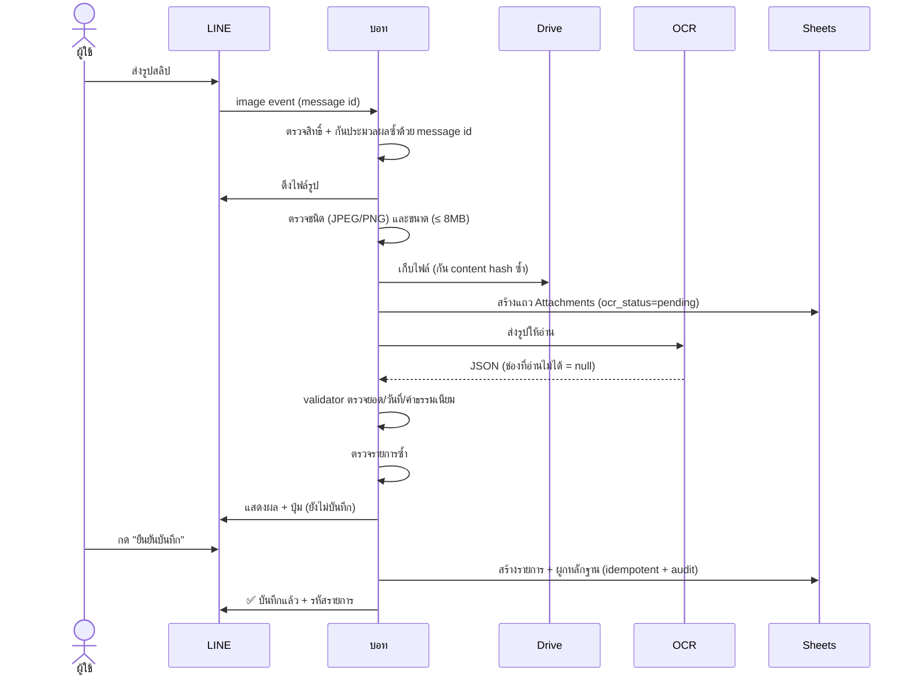
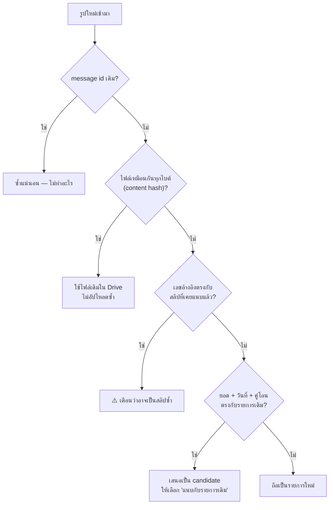
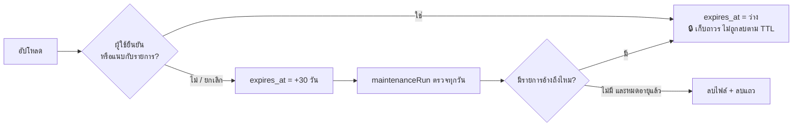

# สลิปโอนเงินและใบเสร็จ (OCR)

**สถานะ:** โค้ดพร้อมและผ่านเทสแล้ว แต่ยังปิดอยู่ (`OCR_ENABLED = false`) และ **ยังไม่ได้ทดสอบกับสลิปจริง**

---

## OCR คืออะไร (และไม่ใช่อะไร)

OCR = อ่านตัวอักษรจากรูปแล้วแปลงเป็นข้อมูลบัญชี

**ไม่ใช่**การตรวจสอบว่าสลิปแท้หรือปลอม และ**ไม่ใช่**การยืนยันว่าเงินเข้าจริง — ระบบอ่านสิ่งที่เห็นในรูปเท่านั้น

---

## เปิดใช้งาน

1. สร้างโฟลเดอร์ใน Google Drive ชื่อ `Household Expense Evidence`
2. แชร์ให้เฉพาะ 2 คน — **อย่าตั้ง "Anyone with the link"**
3. คัดลอก folder ID จาก URL
4. Script Properties:
   - `ATTACHMENT_FOLDER_ID` = folder ID
   - `OCR_ENABLED` = `true`
   - `GEMINI_API_KEY` = key (ใช้ตัวเดียวกับ AI ข้อความได้)
   - `OCR_MONTHLY_BUDGET_USD` = เพดานงบ (แยกจากงบ AI ข้อความ เพราะรูปแพงกว่ามาก)

**ก่อนใช้จริง ควรทดลองความแม่นยำก่อน:** ส่งสลิปตัวอย่าง 10–20 ใบ (ของตัวเองหรือข้อมูลจำลอง) เทียบยอด/วันที่ที่อ่านได้กับของจริง ถ้าแม่นไม่พอ ให้เปลี่ยน `OCR_MODEL` หรือใช้ผู้ให้บริการ OCR อื่นโดยแก้เฉพาะ `OcrService.gs` — ส่วนอื่นของระบบไม่ต้องแก้เพราะแยก adapter ไว้แล้ว

---

## Flow เต็ม

---

## กฎที่ระบบยึด

| กฎ | เหตุผล |
| --- | --- |
| **ไม่บันทึกจนกว่าผู้ใช้กดยืนยัน** แม้รูปชัดมาก | OCR ผิดได้เสมอ |
| ช่องที่อ่านไม่ได้เป็น `null` และถูกถาม ไม่เติมเอง | ห้ามเดาเงิน |
| ยอดโอน ≠ ค่าธรรมเนียม ≠ ยอดคงเหลือในบัญชี | สลิปมีหลายตัวเลข |
| ใบเสร็จ: ใช้ยอดสุทธิ (total) ไม่บวกรายการสินค้าซ้ำ | กัน double counting |
| ถ้าผลรวมสินค้ากับยอดสุทธิไม่ตรง → ทำเครื่องหมาย `line_items_mismatch` | ให้คนตัดสิน |
| ผู้ส่งรูป = ผู้บันทึก แต่**ไม่ใช่ผู้จ่ายเสมอ** | ต้องตรวจ/ถาม |
| โอนให้คู่สมรส → เสนอเป็น `transfer` ไม่นับรายจ่าย | เงินยังอยู่ในครอบครัว |
| สลิปโอนให้**บุคคล** → ถามว่าจ่ายค่าอะไร | ชื่อคนไม่บอกว่าซื้ออะไร |
| สลิปโอนให้**ร้าน** (ขึ้นต้นด้วย ร้าน/บริษัท/หจก...) → เดาหมวดได้ | ชื่อร้านบอกประเภทได้ |
| เงินโอน**เข้า**จากคนอื่นที่ไม่ทราบเหตุผล → ถาม ไม่เดาว่าเป็นเงินคืน | |
| เลขบัญชีถูกปิดบังในข้อความที่แสดงในกลุ่ม | ความเป็นส่วนตัว |
| ไม่ log รูปหรือเลขบัญชีเต็ม | ความเป็นส่วนตัว |

---

## การตรวจรายการซ้ำ

**สำคัญ:** ยอดเงินเท่ากันอย่างเดียว**ไม่ถือว่าซ้ำ** — ข้าวมื้อละ 200 บาทสองมื้อในวันเดียวกันเป็นเรื่องปกติ ต้องมีวันที่ตรงกันด้วยจึงจะเสนอเป็น candidate และถึงอย่างนั้นก็แค่ "เสนอ" ให้เลือก

---

## กรณีที่อ่านไม่ได้

ทุกกรณีจบด้วยการให้ผู้ใช้พิมพ์เอง แล้วระบบแนบรูปที่ค้างอยู่ให้อัตโนมัติ:

| ปัญหา | ระบบทำ |
| --- | --- |
| รูปเบลอ / `readable=false` | บอกให้ถ่ายใหม่หรือพิมพ์ยอดเอง |
| อ่านยอดไม่ได้ | ไม่เดา ให้พิมพ์ยอดเอง |
| JSON ผิด schema | ทิ้งผล ให้พิมพ์เอง |
| งบ OCR หมด | บอกตรง ๆ ว่างบเต็ม เก็บรูปไว้ให้ ให้พิมพ์เอง |
| ดึงรูปจาก LINE ไม่ได้ (หมดอายุ) | ให้ส่งรูปใหม่ |
| ไม่ใช่ JPEG/PNG | ปฏิเสธ ไม่เก็บไฟล์ |

**การแนบอัตโนมัติผูกกับคนส่งเสมอ** — รูปของภรรยาจะไม่ถูกแนบกับข้อความของสามี ถ้าคนเดียวส่งหลายรูปค้างไว้ ระบบแนบรูปล่าสุดก่อนทีละรูป

---

## วงจรชีวิตของไฟล์

---

## ต้นทุน

รูปกินโทเคนมากกว่าข้อความหลายเท่า จึงมีงบแยก (`OCR_MONTHLY_BUDGET_USD`) และจองงบก่อนเรียกเหมือนกัน เมื่อเต็มจะหยุดอ่านรูปแต่ยังเก็บรูปเป็นหลักฐานและให้พิมพ์เองได้

ดูยอดใช้จริงในแท็บ `Usage` แถวที่ `provider = gemini-ocr`

---

## ข้อจำกัดของรุ่นนี้

- รองรับ **JPEG/PNG** เท่านั้น — PDF และหลายหน้ายังไม่รองรับ
- ใบเสร็จที่แยกสินค้าหลายหมวดยังบันทึกเป็นรายการเดียว (แยกเองภายหลังได้)
- ยังไม่ได้ทดสอบกับสลิปธนาคารจริงหลากหลายธนาคาร — ต้องทดลองก่อนไว้ใจ
- การสำรองชีตไม่ครอบคลุมไฟล์รูป ดู [backup-restore.md](backup-restore.md)
