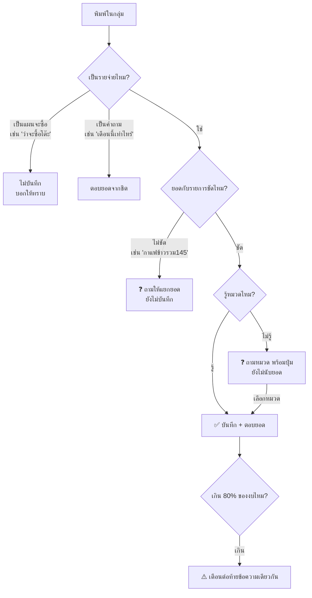
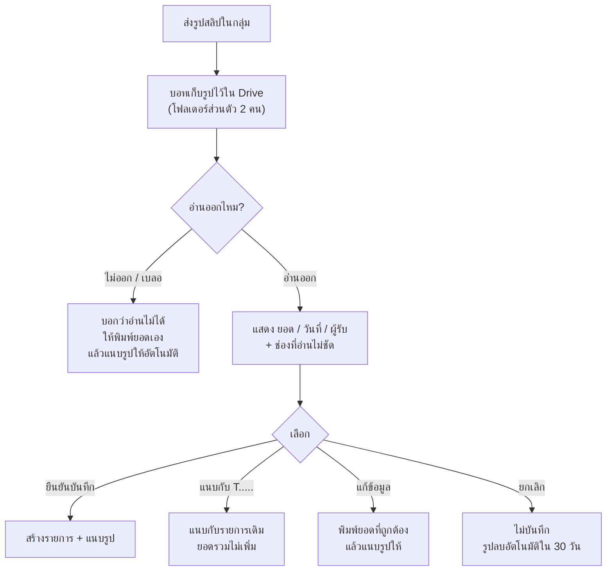

# คู่มือผู้ใช้ — จดรายจ่ายในกลุ่ม LINE

สำหรับคนใช้งานประจำวัน ไม่ต้องรู้เรื่องเทคนิค

---

## จดรายจ่าย: พิมพ์เหมือนคุยกันปกติ

```
ค่าส้มตำ 200
```

บอทตอบ:

```
✅ บันทึกแล้ว
• T7K2QA · รายจ่าย · ค่าส้มตำ · 200 บาท · [อาหาร] · จ่ายโดย ยุทธ · 8 ก.ย. 2026
[แก้ไข] [ยกเลิกรายการ]
```

`T7K2QA` คือรหัสรายการ ใช้ตอนแก้หรือยกเลิก

### พิมพ์ได้หลายแบบ

| พิมพ์แบบนี้ | ได้แบบนี้ |
| --- | --- |
| `ค่าส้มตำ200` | ติดกันก็ได้ ไม่ต้องเว้นวรรค |
| `กาแฟ 65 ข้าว 80` | แยกเป็น 2 รายการอัตโนมัติ |
| `เมื่อวานเติมน้ำมัน 300` | ลงวันเมื่อวาน |
| `ค่าข้าว 120 วันที่ 5/9/2026` | ระบุวันเองได้ |
| `ผ้าอ้อมลูก 499 เมียจ่าย` | คนบันทึกคือคุณ แต่คนจ่ายคือภรรยา |
| `ค่าอาหาร 1,250.50` | มีลูกน้ำและสตางค์ได้ |
| `คืนเสื้อ ได้เงินคืน 200` | เงินคืน หักออกจากยอดหมวดนั้น |
| `โอนให้เมีย 3000` | โอนกันเอง ไม่นับเป็นรายจ่าย |

---

## เส้นทางของข้อความ 1 ข้อความ



**หลักสำคัญ:** ถ้าบอทไม่แน่ใจ บอทจะ**ถาม** ไม่เดา และ**ยังไม่นับยอด**จนกว่าจะตอบคำถามนั้น

---

## ดูยอด

| พิมพ์ | ได้ |
| --- | --- |
| `วันนี้` | ยอดวันนี้ แยกหมวด |
| `เดือนนี้` | ยอดเดือนนี้ + สถานะงบ |
| `เดือนที่แล้ว` | ยอดเดือนก่อน |
| `เดือนนี้ค่าอาหารเท่าไหร่` | เฉพาะหมวดอาหาร |
| `เดือนนี้ใครจ่ายเท่าไหร่` | แยกตามคนจ่าย |
| `เทียบเดือนก่อน` | เทียบช่วงวันเท่ากัน |
| `รายการล่าสุด` | 5 รายการล่าสุดพร้อมรหัส |

> ทุกคำตอบระบุช่วงวันที่และบอกว่า "จากรายการที่บันทึก" เสมอ — เป็นยอดของสิ่งที่จดไว้ ไม่ใช่ค่าใช้จ่ายทั้งหมดในชีวิตจริง

---

## แก้ไขและยกเลิก

**ยกเลิกรายการ**
```
ยกเลิก T7K2QA
```
→ บอทแสดงก่อน/หลัง แล้วให้กด **ยืนยันยกเลิก** ยอดสรุปจะลดลง แต่ประวัติยังอยู่ในระบบ

**แก้ไข**
```
แก้ T7K2QA ยอด 250
แก้ T7K2QA หมวด อาหาร
แก้ T7K2QA วันที่ 05/09/2026
แก้ T7K2QA ผู้จ่าย เมีย
แก้รายการล่าสุด
```
→ แสดงก่อน/หลัง แล้วให้ยืนยัน

**ถ้าอีกคนแก้รายการเดียวกันพร้อมกัน** บอทจะไม่ทับข้อมูล แต่จะบอกว่า "รายการนี้เพิ่งถูกแก้โดยอีกคน" ให้ดูข้อมูลล่าสุดก่อนแก้ใหม่

**กดปุ่มยืนยันซ้ำ** ไม่ทำให้แก้ซ้ำหรือยอดเพี้ยน บอทจะบอกว่า "ทำไปแล้ว"

---

## งบรายเดือน

```
ตั้งงบอาหาร 8000 เดือนนี้      → แสดงก่อน/หลังแล้วให้ยืนยัน
เหลืองบอาหารเท่าไหร่           → ดูยอดคงเหลือ
```

- หมวดที่ยังไม่ตั้งงบ บอทจะบอกว่า **"ยังไม่ตั้งงบ"** ไม่แต่งตัวเลขขึ้นมาเอง
- เตือนอัตโนมัติที่ **80%** และ **100%** แนบท้ายข้อความตอนบันทึก (ระดับละครั้งเดียวต่อเดือน)
- เงินคืนและการยกเลิกรายการทำให้งบคงเหลือขยับกลับถูกต้อง

---

## สอนบอทให้จำหมวด

เมื่อคุณเลือกหมวดให้รายการที่บอทไม่รู้จัก บอทจะถามว่า:

```
จำไว้ไหมครับว่า "ร้านลุงหมี" = ของใช้และตกแต่งบ้าน?
[จำไว้] [ครั้งนี้ครั้งเดียว]
```

- กด **จำไว้** → ครั้งต่อไปไม่ต้องถามอีก
- กด **ครั้งนี้ครั้งเดียว** → ไม่สร้างกฎถาวร
- ดูกฎที่จำไว้: พิมพ์ `กฎที่จำ`
- เลิกใช้กฎ: พิมพ์ `ลืมกฎ R0025`

> กฎที่สอนเองจะไม่ไปทับความหมายของรายการ เช่น สอนว่า "อีเกีย = ของแต่งบ้าน" แล้วพิมพ์ "กินข้าวที่อีเกีย 200" ก็ยังลงหมวดอาหารถูกต้อง

---

## ส่งรูปสลิป (ถ้าเปิดใช้)



จุดสำคัญ:
- **ไม่บันทึกจนกว่าจะกดยืนยัน** แม้รูปจะชัดมาก
- โอนให้ภรรยา → เสนอเป็น "โอนภายใน" ไม่นับรายจ่าย
- สลิปโอนให้บุคคล บอท**ถามว่าจ่ายค่าอะไร** ไม่เดาจากชื่อคนรับ
- ส่งสลิปเดิมซ้ำ บอทเตือนว่าอาจซ้ำ
- ค่าธรรมเนียมโอนไม่ถูกบวกรวมกับยอด
- เลขบัญชีถูกปิดบังในข้อความที่แสดงในกลุ่ม

---

## เมื่อบอทตอบแปลก ๆ

| บอทตอบ | หมายความว่า | ทำอย่างไร |
| --- | --- | --- |
| 📥 รับไว้แล้ว กำลังประมวลผล | ระบบช้ากว่าปกติ แต่ข้อความถูกเก็บแล้วแน่นอน | พิมพ์ `สถานะ` ดูผล อีก 10 นาทีระบบจะทำต่อเอง |
| ❓ ถามหมวด/ถามยอด | ข้อมูลไม่ชัดพอ | ตอบคำถาม หรือกดปุ่ม |
| ⚠️ ระบบมีปัญหาชั่วคราว | มี error | ส่งใหม่อีกครั้ง ยอดจะไม่ซ้ำ |
| ไม่แน่ใจว่าจะบันทึกอะไร | ไม่เจอจำนวนเงิน | พิมพ์ชื่อรายการ + ตัวเลข |
| เงียบไม่ตอบ | ข้อความไม่มีจำนวนเงินและไม่ใช่คำสั่ง (คุยกันปกติ) | ปกติ ไม่ต้องทำอะไร |

**จะไม่มีทางเกิดขึ้น:** ยอดถูกบันทึกซ้ำจากการส่งซ้ำ หรือรายการหายไปเงียบ ๆ ทุกอย่างตรวจได้จาก `สถานะ` และแท็บ `AuditLog` ในชีต

---

## คำสั่งทั้งหมด

พิมพ์ `ช่วยเหลือ` ในกลุ่ม หรือดู [commands.md](commands.md)
