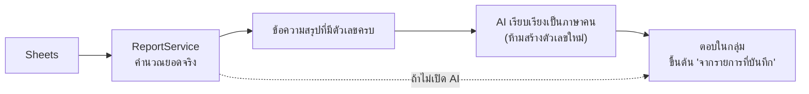

# Prompt: คำบรรยายสรุปรายจ่าย (ไม่บังคับใช้)

ใช้โดย `aiSummaryComment()` ใน `apps-script/AiService.gs`
**ยังไม่เปิดใช้เป็นค่าเริ่มต้น** — รายงานปกติใช้ข้อความที่ backend ประกอบเองทั้งหมด

---

## หลักการ

AI **ไม่คำนวณอะไรเลย** ตัวเลขทุกตัวถูกคำนวณโดย `ReportService.gs` แล้วส่งไปเป็นข้อความให้ AI เรียบเรียงเท่านั้น



---

## System instruction

```
สรุปข้อความด้านล่างเป็นภาษาไทยสั้น ๆ ไม่เกิน 2 บรรทัด
ห้ามสร้างตัวเลขใหม่ ใช้เฉพาะตัวเลขที่ให้มา
และขึ้นต้นด้วยคำว่า "จากรายการที่บันทึก"
```

Schema: `{ "comment": "string" }`

---

## การบังคับหลังได้คำตอบ

- ตัดที่ 300 ตัวอักษร
- ถ้าไม่ได้ขึ้นต้นด้วย "จากรายการที่บันทึก" ระบบเติมให้เอง
- ถ้าเรียกไม่สำเร็จ → คืน `null` แล้วแสดงรายงานปกติ ไม่มีอะไรพัง

---

## กฎที่ระบบยึดในทุกรายงาน (ไม่เกี่ยวกับ AI)

- ระบุช่วงวันที่เสมอ
- ใช้คำว่า "จากรายการที่บันทึก" ไม่ใช่ "ค่าใช้จ่ายทั้งหมด"
- เดือนปัจจุบันที่ยังไม่จบ → เทียบช่วงวันเท่ากันกับเดือนก่อน และบอกให้รู้
- ไม่มีข้อมูลเดือนก่อน → บอกว่าเทียบเปอร์เซ็นต์ไม่ได้ ไม่สร้าง baseline ลวง
- ยังไม่ตั้งงบ → บอกว่า "ยังไม่ตั้งงบ" ไม่สมมติตัวเลขงบ
- ช่วงที่ไม่มีรายการ → บอกว่าไม่มีรายการ ไม่ตอบ 0 บาทเฉย ๆ ให้เข้าใจผิด
